# Assignment: PostGIS to Geoserver

## Background
Geoserver most commonly serves data from databases. Having databases back a geoserver layer allows the layer to be dynamic, meaning that geoserver will always serve the most recent data. Updating static files such as shapefiles is quite cumbersome and error-prone, not to mention slow. In this lab you are going to create geoserver layers from the PostGIS tables of OpenStreetMap data derived from geofrabrik shapefiles. As part of this process, you will also create Style Layer Descriptors, or SLDs, from QGIS, to allow geoserver to customize the symbolization of your data.

### Important note on screenshots in this doc
**Screenshots of instructions below reflect a time when this lab was not running in codespaces.**
- **Wherever it says "localhost:8080" you will need to use your `Local Address` from the codespace's forwarded port 8080.**
- **Screenshots reflect a time when this lab was using `arizona` as the database. Update to `hawaii` as needed**

## Assignment
### Deliverables: 
Create a github branch named `assignment` with the following files, submitting as a Pull Request to `master`:
- `landuse.sld`
- `roads.sld`
- `pois.sld`
- `geoserver_layer_group_preview.png` - OpenLayers preview of `osm` Layer Group, zoomed into the island of Kauai
- `qgis_layer_group_preview.png` - QGIS view of `osm` Layer Group

### Check the initialization setup
The initialization step for this codespace includes some scripting to pre-populate some things that you did in previous classes.

First check that the `docker.osgeo.org/geoserver` and `mdillon/postgis` containers are running. The `aaryno/populate-docker-geo` will probably not be running, which is ok.

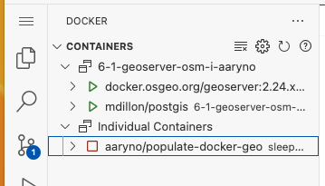

_If this is not running, you can re-run the containers with `docker compose up -d` from your terminal_

Next, check the OSM data in postgis. I wrote a [script](https://github.com/ua-gist-open-source/docker-compose-populate) that will setup the OSM database, download the OSM hawaii data from geofabrik.de, and load the data into PostGIS.  In a Terminal Window, enter:
```
psql -d hawaii -c "select count(*) from roads"
```
You should get a row count of tens or hundreds of thousands of rows. On November 12, 2023 it was 76380:

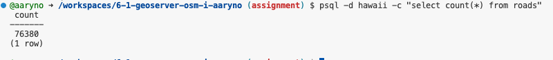

_If the database does not exist or the row count is 0, run the populate script manually with: `docker run  --network gist604b -e STATE=hawaii -e DATABASE=hawaii aaryno/populate-docker-geo populate-postgis.sh`_


### Check the OSM database
You can check on the data via the PostGIS Extension (Elephant icon). The settings are the same as before:
- host: `postgis`
- username: `postgres`
- password: `postgres`
- port: `5432`
- `Standard Connection`
- database: `hawaii`
- name: `osm-hawaii`


### Load the layers in Geoserver
Find out your Local Address of your forwarded port in your browser. 

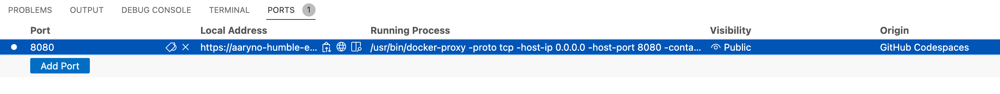

Add the `geoserver/web` to the Local Address to get the URL to geoserver and open it in a web browser. Remember the username/password are in your docker-compose.yml file but they default to `admin`/`geoserver`.

#### Create a workspace named `osm`
Geoserver uses workspaces to organize data. Generally speaking, you would create a workspace for a project or a specific
type of data. In this exercise, create a new workspace for all your OSM data. To simplify this assignment, set this new workspace as the default and use the namespace `osm`

Refer to the geoserver documentation about how to add a Workspace. 
- [https://docs.geoserver.org/stable/en/user/data/webadmin/workspaces.html](https://docs.geoserver.org/stable/en/user/data/webadmin/workspaces.html)

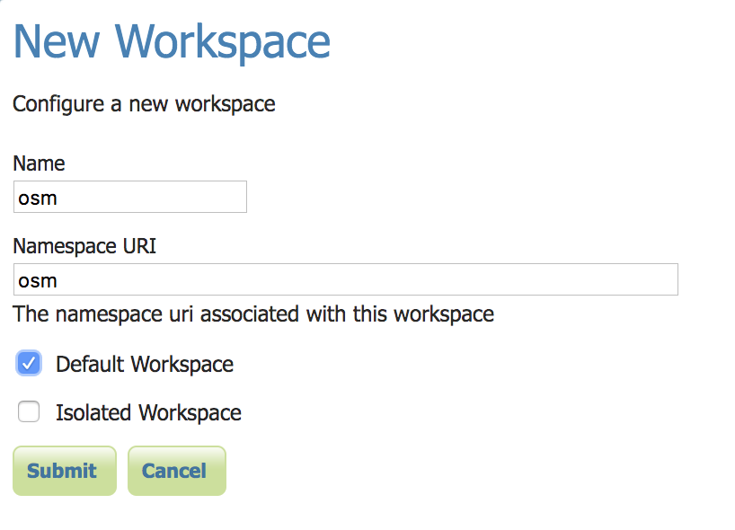

#### Create a data store named `osm`
Before you can add the data from the database we need to tell geoserver about the data location. Geoserver uses the term
`data store` to refer to how it data is made available to geoserver. Specifically in this exercize you will create a PostGIS
Data Store, giving geoserver the hostname , as well as database name, and username and password (`postgres` and `postgres`). 

In the docker compose implementation, the hostname of the DB server is the name of the service, `postgis`.
The database name will be either `hawaii` or `arizona`, depending on which version of the assignment you completed.

Refer to the geoserver documentation about how to add a PostGIS Data Store. 
- [https://docs.geoserver.org/stable/en/user/data/database/postgis.html](https://docs.geoserver.org/stable/en/user/data/database/postgis.html)

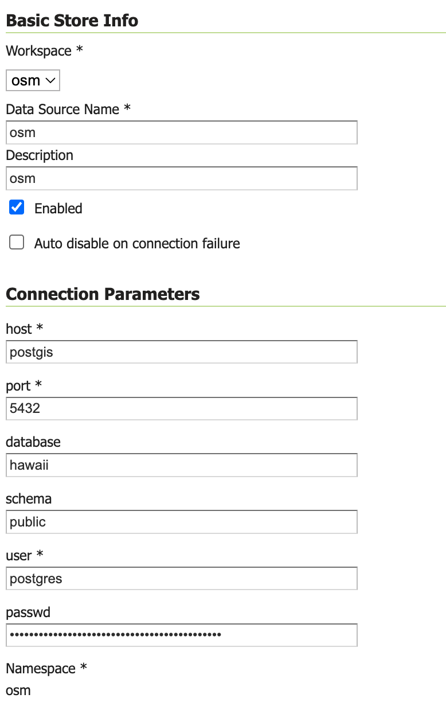

#### Add PostGIS layers to geoserver
You worked with layers previously in geoserver but now are going to add them yourself. Read up on geoserver layers at
[https://docs.geoserver.org/stable/en/user/data/webadmin/layers.html](https://docs.geoserver.org/stable/en/user/data/webadmin/layers.html). 

Be sure to select the appropriate data source for the layer source next to `Add layer from [Choose One]`. Note that the hostname is `postgis`, which is something special we did with the docker compose setup.
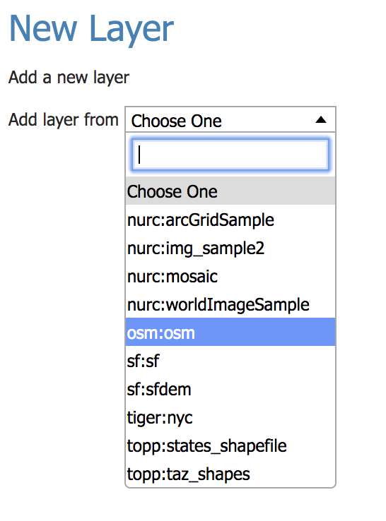

The next screen will list your data tables. By default they will not be published as layers until you click on `Publish`.
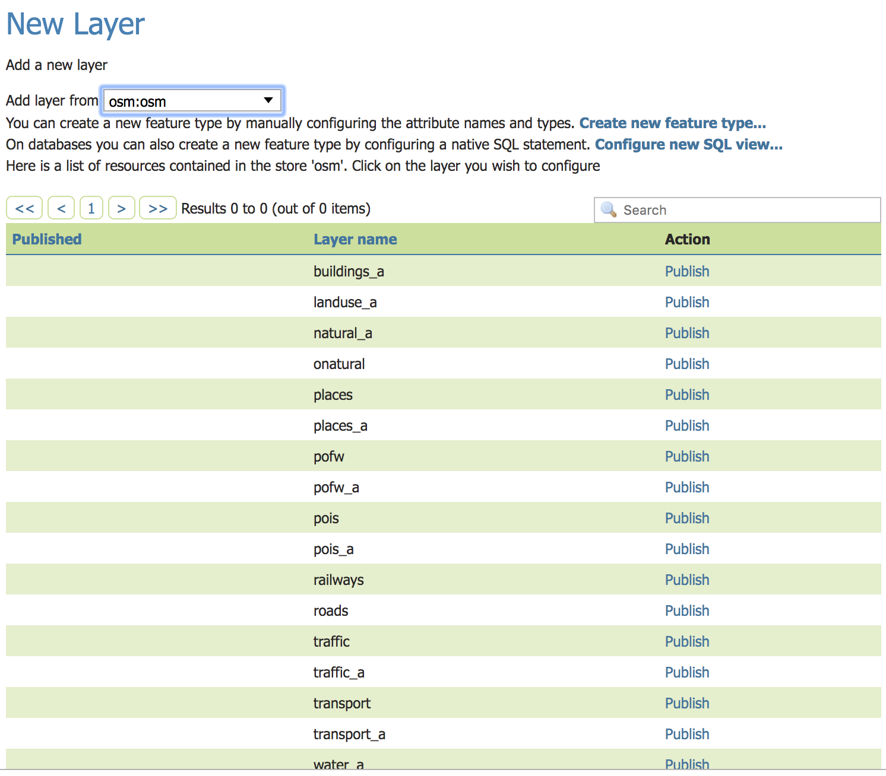

Clicking `Publish` on one of the layers brings up a multi-tabbed window.
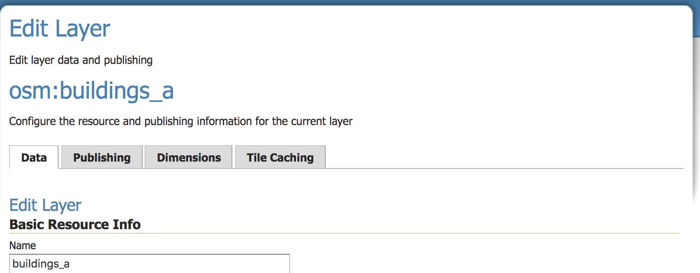

To get started, scroll down to the section for `Bounding Box` and click `Compute from data` and `Calculate from native bounds` to populate the bounding box data.

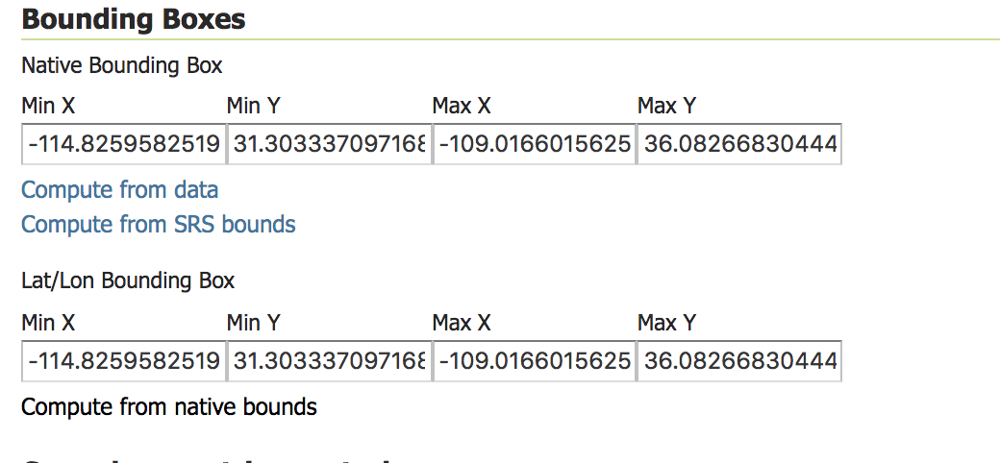

Finally, this software has some legacy aspects to it. One is that _settings are not saved until you click on the `Save` button._ Be sure to click SAVE!

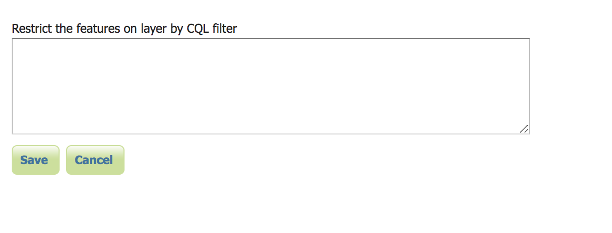

##### Layer Preview
To see a preview of your layer, click on `Layer Preview` in the left hand main menu, and then click `Open Layers` in the
row for a given layer. This will bring up a minimal interactive map to look at your data. For example, this is what your `buildings_a` preview might look like:

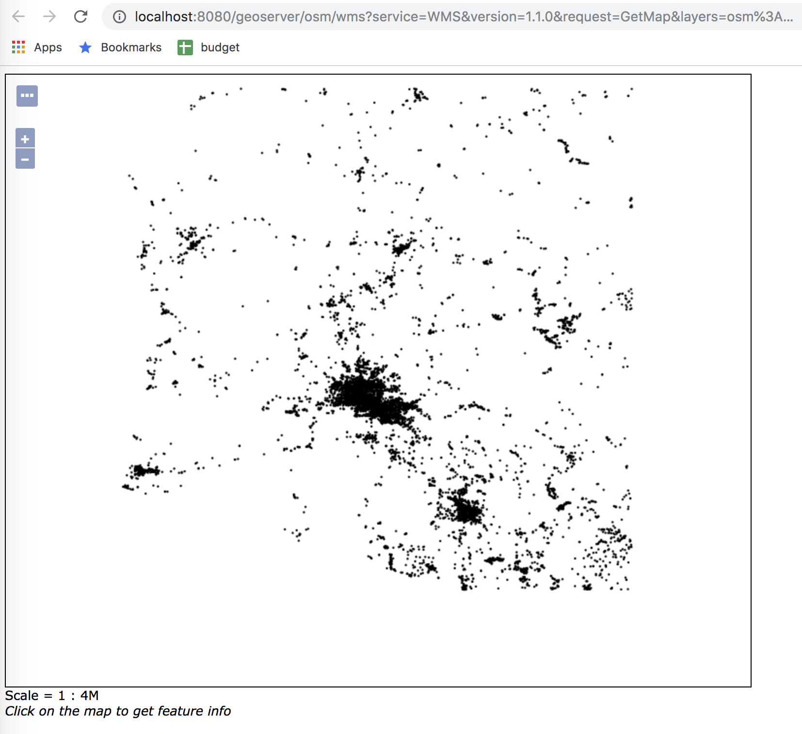

#### Repeat this process for all your OSM layers.

### Create Styles for layers in QGIS
Open your PostGIS layers in QGIS (`Layer` -> `Add PostGIS Layers` ). QGIS will generate random simple symbologies.
Right click on your `buildings` layer. Change the symbology to `Categorized` and select `type` as the classification Column.
Click `Classify` to load all the unique values for this column. Update the symbology if you desire. When you are satisfied,
Click on the `Style` drop-down at the bottom of the dialog and select `Save style`. 

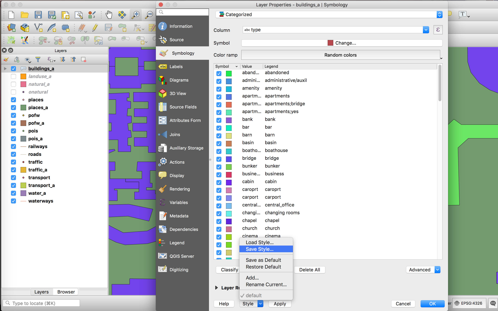

Save as `SLD Style File`. Give it the same name as the table name but with the `.sld` file suffix.
Repeat for the tables: `pois`, `roads`, and `landuse`.

#### Deliverables: SLD files for `landuse`, `roads`, and `pois`.

### Create Styles for layers in Geoserver
Read up on styles at [https://docs.geoserver.org/stable/en/user/styling/index.html#styling](https://docs.geoserver.org/stable/en/user/styling/index.html#styling).

In Geoserver, click on `Styles` at the left main menu and then `Add a New Style`. Fill in the name of the style (`buildings_a` for example, matching the table name) and specify the `osm
` workspace. Click on the `Choose File` button
and select the SLD file for the style you are creating, then click `Upload`. 

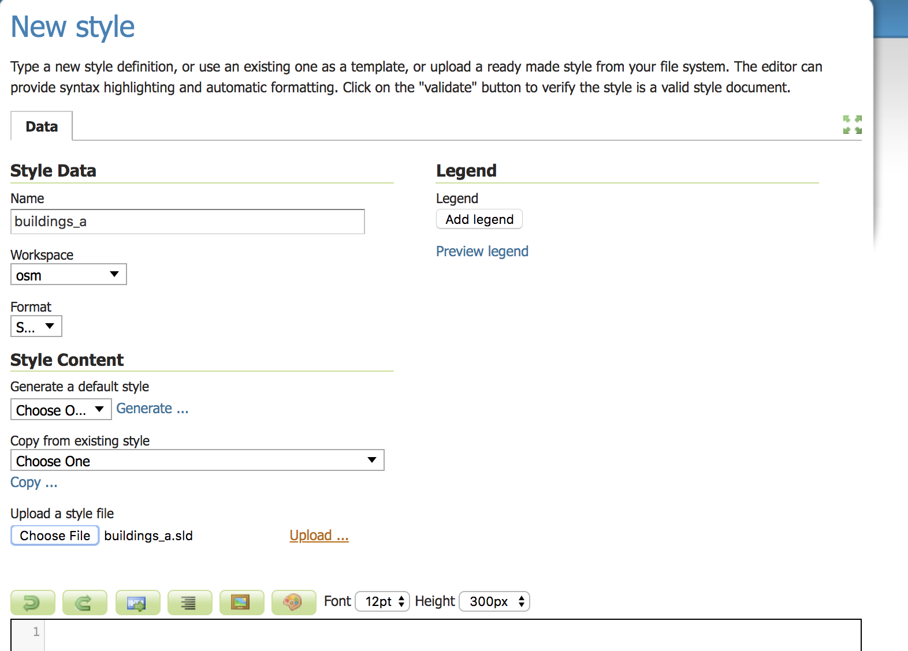

This will load the file and fill the dialog below with the text from the SLD file. Scroll down and inspect the loaded style:

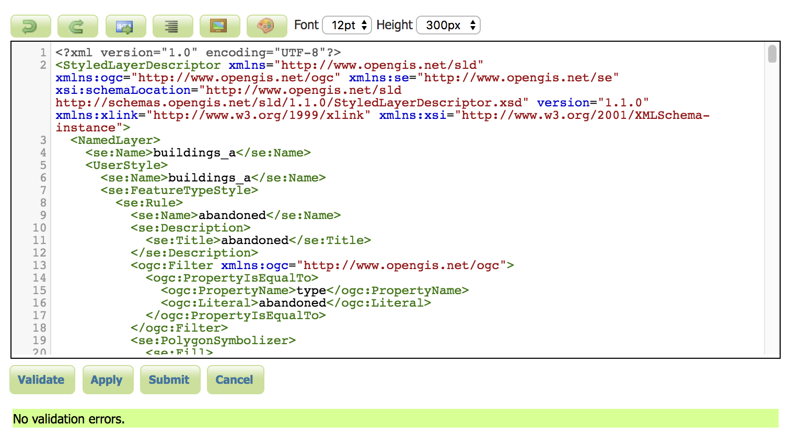

Don't edit the SLD here, but just in case, click on `Validate` to make sure there are no validation errors, then `Apply` or `Save`.

Repeat for all the styles you made SLDs for above.

### Create a Layer Group
Layers can be grouped together for complex cartography. Read up on layer groups: [https://docs.geoserver.org/stable/en/user/data/webadmin/layergroups.html](https://docs.geoserver.org/stable/en/user/data/webadmin/layergroups.html).

Create a Layer group named `osm` with the title `OSM` in the `osm` workspace. 

Add all the PostGIS layers to the layer group. Arrange them in order so that points and lines are over polygons. 
The order listed is actually the `Drawing Order`, which will be in reverse order of what will appear on top; that is, 
layers at the top of the list will be drawn first and layers at the bottom will be drawn last. Thus, you will want
lines and points _below_ the polygon layers.

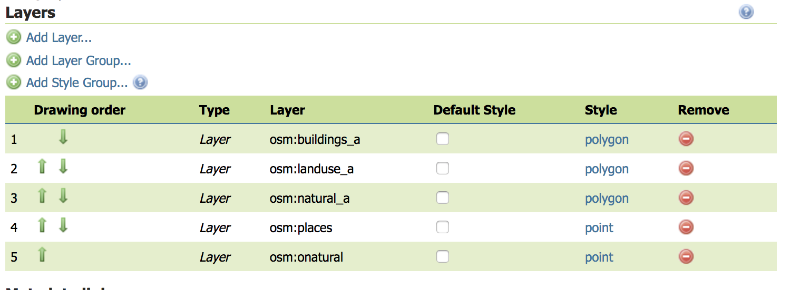

Be sure to `Generate Bounds` and then `Save` the Layer Group like you did for the Layers.

#### Deliverable: Geoserver Screenshot
Visit the Layer Groups list in geoserver and look at the Open Layers preview. Zoom into a populated area and take a screen capture 
of your browser. Name it `geoserver_layer_group_preview.png`

### Load the Geoserver Layer Group from QGIS

In QGIS, click `Layer` -> `Add Layer` -> `WMS/WMTS`. You should have your local geoserver connection saved from
previously but, if not, add a new connection to your geoserver instance by adding the url to the WMS GetCapabilities request. 
While remembering the URL could be handy, it will be easiest for you to visit the `Demos` link on the left-hand main menu
of geoserver webpage and find the `WMS_getCapabilities.url`. 

Once you are connected to your geoserver instance from within QGIS in the `WMS/WMTS` dialog, you should see your newly created `osm` Layer Group. 

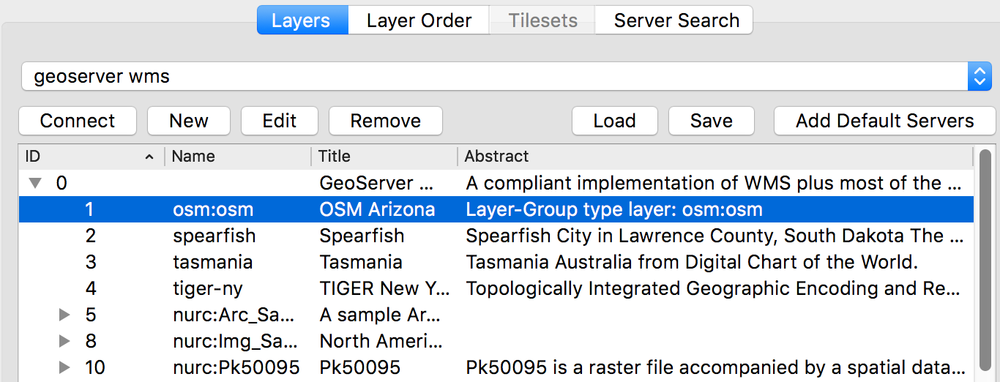

#### Deliverable: QGIS Screenshot
Take a screenshot of your QGIS desktop (including the layer list and the map) showing the OSM Workshop Layer Group. Name it `qgis_layer_group_preview.png`

[](https://zenodo.org/badge/latestdoi/182493806)

